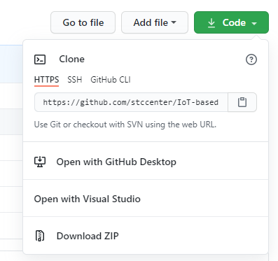

## What is the software requirement?
* Python 3.7

## What are the required python packages?
* PyTorch 1.7.0 (code has GPU support, but can run without)
* Pandas 1.0.1
* scikit-learn
* scipy
* numpy
* matplotlib

## How to set up the project environment?
* Clone the project by clicking on the download button 

* Open the project folder with your choice of python IDE
* Execute below comment to install required python packages. 
        pip install -r requirements.txt

## Where to download the data?
* Dataset can be downloaded [here](https://exchangelabsgmu-my.sharepoint.com/personal/jyang43_masonlive_gmu_edu/_layouts/15/onedrive.aspx?id=%2Fpersonal%2Fjyang43%5Fmasonlive%5Fgmu%5Fedu%2FDocuments%2Fdissertation%2Ftemperature%20prediction%2Fpaper%20drafting%2Fgit%5Fcode%5Fsup%2Fdata&originalPath=aHR0cHM6Ly9leGNoYW5nZWxhYnNnbXUtbXkuc2hhcmVwb2ludC5jb20vOmY6L2cvcGVyc29uYWwvanlhbmc0M19tYXNvbmxpdmVfZ211X2VkdS9Fbi1UWkxGNFVWQkFxeUN0aXlRT1lNMEJVM2xlRkw0VFNDSmQxOHhvSVhvdkdBP3J0aW1lPWFiRjJFVFhOMkVn). 

**Note**: Please contact the author Jingchao Yang (jyang43@gmu.edu) for direct access if link expires.
* Place the dataset in the data folder before running the code

**Note**: All data has been preprocessed to csv format, raw data can be accessed from [weather underground](https://www.wunderground.com/) and [GeoTab](https://data.geotab.com/weather/temperature). Toolset for preprocessing raw data can be accessed upon request.

## How to get the results?
### Category of models
* [multistep_lstm](multistep_lstm) indludes python files for LSTM model building and training
* [multistep_others](multistep_others) includes comparison model ARIMA and XGBoost

### 1. LSTM model:
To run our LSTM model, go to the [directory](multistep_lstm) and using the command:

`python run_auto.py --transLearn=False`

Argument "transLearn" controls regular model training (set to False) or transfer learning (set to True), more detail about transfer learning will be published in the next coming paper. LA Dataset already includes trained models and ready for transfer learning, user can delete the content inside the LA/output to retrain

### 2. Other models
Creat result folder under multistep_others for model output. ARIMA and XGBoost are for model comparison and were not developed for transfer learning.

#### 2.1 ARIMA
To run our ARIMA model, go to auto_arima_run.py

#### 2.2 XGBoost
To run our XGBoost model, go to xgboost_run.py

## Useful links
* [Tutorial](https://stackabuse.com/time-series-prediction-using-lstm-with-pytorch-in-python/) for LSTM using pytorch
* [Tutorial](https://www.kaggle.com/sumi25/understand-arima-and-tune-p-d-q) for ARIMA
* [Tutorial](https://www.kaggle.com/furiousx7/xgboost-time-series) for XGBoost

## Author
Jingchao Yang  
Email: jyang43@gmu.edu
